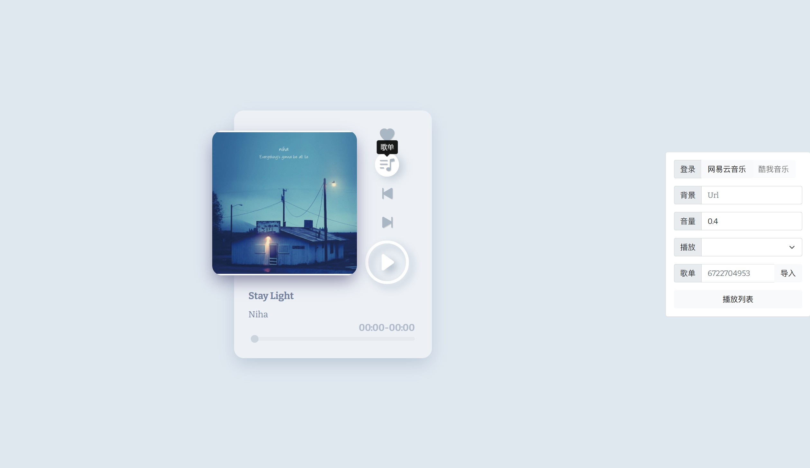

<h2 align="center"> Momotalk Editor </h2>

网页端的碧蓝档案聊天对话生成器

### 特性

- **可搜索学生**: 能够通过学生名字(汉字/拼音/罗马音)，也游戏黑话快速搜索. 
- **自定义角色**: 发言角色包括老师、学生，也可以上传图片自定义角色. 
- **消息类型丰富**: 除了文字还能发送图片、贴图、角色差分、选项框和羁绊剧情框. 
- **灵活的编辑**: 聊天框可随意添加、插入、删除、编辑、拖动位置. 
- **导出格式**: 对话可以保存为图片/json文件(支持导入导出). 
- **本地持久化**: localStorage实时保存，不用担心停电数据丢失. 
- **Momotalk播放器**：实现游戏中Momotalk对话剧情播放功能
- **AI·Arona**：可以填入ChatGPT Api-key开始与阿罗娜对话

---

<h2 align="center">碧蓝档案视频处理工具</h2>

针对视频的打轴&汉化工具（没有翻译

### 主要功能

- **剧情汉化**：消去视频日文字幕并替换为翻译文本
- **自动打轴**：通过 ocr 自动生成**对帧轴**文件（此功能对任意视频通用）

---
<h2 align="center">One-Pic</h2>

游戏情报一图流生成器

### 主要功能

- 生成一图流情报图

[Try it!](onepic.u1805.repl.co)

---

<h2 align="center"> Ease Music </h2>

网易云音乐播放器（初见 Vue 练习）

### 功能

🌕 播放器基本功能：

上一曲、下一曲、播放、暂停、单曲循环、列表循环、随机循环、进度条、音量控制

🌕 歌单相关功能：

搜索、导入歌单、网易云登录、导入个人歌单列表、歌单点播、收藏歌曲、播放收藏歌曲

🌕 没有实际作用的功能：

背景更换（链接/本地上传）、界面可拖拽

